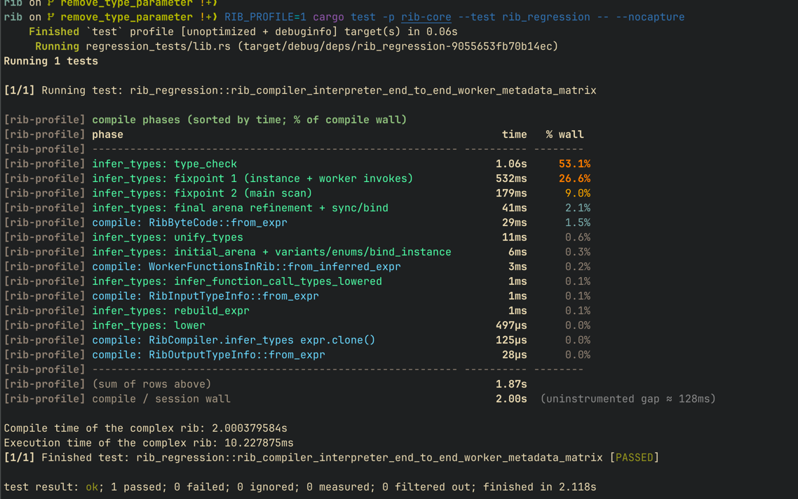

## Rib compilation profile

Rib type inference has multiple phases. Each phase will contribute to the total time taken for compiling a rib script.
There are a few hotspots now which could be fixed. To understand which phase is taking more time, run any test setting the RIB_PROFILE to 1

   ```bash
   RIB_PROFILE=1 cargo test -p rib-lang --test rib_regression -- --nocapture
   ```
Please see a screenshot of the output below:

