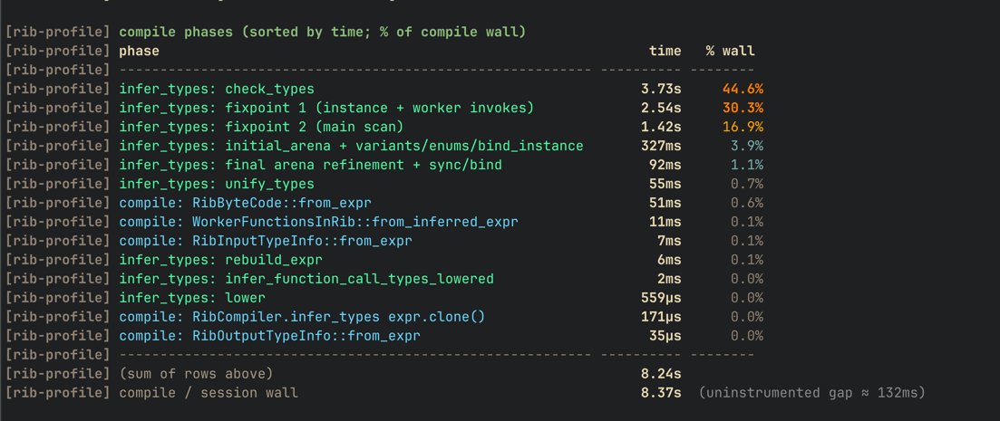

# rib-core

Core library for the Rib language: parser, type inference, compiler, and interpreter.

## Profiling compile time

### How to produce the profile output



**Set the environment variable** for the single command that runs the compiler (prefix the command; no code changes needed):

   ```bash
   RIB_PROFILE=1 cargo test -p rib-core --test rib_regression -- --nocapture
   ```
