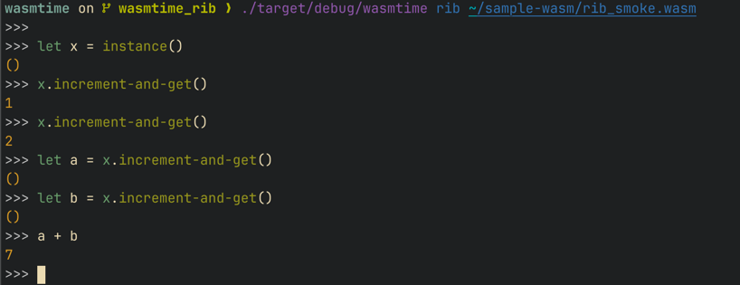

# `rib-repl`

**Crate:** [`rib-repl`](https://crates.io/crates/rib-repl) on crates.io.

`rib-repl` is a **read–eval–print loop** library for **WebAssembly components**. End users type **Rib** (implemented by [`rib-lang`](../rib-lang/README.md)); this crate supplies the **session**, **line editor**, **completion**, **highlighting**, and **static checking** of each line against the loaded component **before** the embedder’s invocation hook runs.

**Language guide:** [golemcloud.github.io/rib/guide.html](https://golemcloud.github.io/rib/guide.html) — syntax, literals, and patterns for the Rib lines users type here.

Example: Once the component is loaded, the following will result in `3`, if the component exports a stateful `increment_and_get` method.

```
>>> let a = instance();
>>> let b = a.increment-and-get();
>>> let c = a.increment-and-get();
>>> b + c
```

---

## Syntax, literals, and completion

**Rust-shaped surface** — Rib’s syntax is similar to Rust's to some extent, to make it easy for Rust developers to pick up. Those who are into webassembly and WIT will find familiar constructs like records, variants, lists, `option`, and `result` in the same style as Wasm Wave. The syntax is not a full Rust subset; it is designed for interactive exploration of component exports rather than general-purpose programming.

**Wasm Wave literals** — Concrete values in Rib use the same **textual conventions as [Wasm Wave](https://github.com/bytecodealliance/wasm-tools/tree/main/crates/wasm-wave)** (via `rib-lang` and `wasm-wave`). Anyone already using Wave or WIT in the Wasm toolchain should recognise record, list, `option`, `result`, and scalar syntax without learning a Rib-specific literal format.

**Tab completion and argument stubs** — The REPL is built around **`rustyline`** completion (`rib_edit.rs`). Besides export and identifier completion, when the user completes a **call** (for example after typing `(` on a resolved function or method), the editor can offer a **full argument list** filled with **type-correct placeholder values**: `value_generator::generate_value` walks each parameter’s **`WitType`** and builds a **`ValueAndType`**, then formats it with the same Wave-style printing used elsewhere. Those stubs are meant to be edited, not final logic—but they **satisfy the WIT signature** so exploration starts from a well-typed skeleton.

---

## Session semantics

**One guest instance per Rib instance name** — Rib identifies a logical component instance by a **instance name**. A bare **`instance()`** in source gets a **fresh unique name** each time, so two bindings like `let x = instance(); let y = instance();` refer to **two independent** guest instances (separate state). To share state, use the same string for **`instance("name")`** on each binding that should alias the same guest.

**Embedder responsibility** — Your `ComponentFunctionInvoke` (or equivalent) implementation must treat that worker name as the key: **one** Wasm `Instance` (or your runtime’s equivalent) per distinct name for the lifetime of the REPL session, unless you deliberately reload. Anonymous `instance()` calls must each map to a **unique** instance. This is how Wasmtime and other hosts preserve the semantics above.

**Names from `let` carry across lines** — If you type `let x = …`, later lines can use **`x`** again, the same way variables work in any REPL. That is ordinary **`let`** behaviour: the session keeps the values you already defined so you do not repeat large literals or constructor calls on every line.

**Static checking** — `rib-lang` type-checks input against the component metadata registered for the session. Many errors surface as **Rib diagnostics** prior to any Wasm export call, reducing noisy trap-driven failures during exploration.

---

## Rationale for Wasmtime and similar hosts

After load, component authors and runtime integrators routinely need to:

- Exercise exports with **realistic** `record`, `variant`, `list`, and `result` values without a new Rust `main` per experiment.
- Retain **one guest instance per worker name** while calling constructors, methods, or other stateful exports in sequence (several anonymous `instance()` calls ⇒ several independent instances).
- Reuse **[Wasm Wave](https://github.com/bytecodealliance/wasm-tools/tree/main/crates/wasm-wave)**-compatible value text where possible instead of bespoke string formats.

`rib-repl` packages those requirements behind **`RibRepl::bootstrap`** / **`RibReplConfig`**: link the crate, implement **`ComponentFunctionInvoke`**, supply dependency loading, and obtain a `rustyline`-driven loop on top of the same **`rib`** pipeline tests may invoke directly.

---

## How to add a REPL to your Wasm component host

1. Add a **`rib-repl`** dependency to your host crate (e.g. Wasmtime CLI).
2. Then bootstrap a `RibRepl`  using `RibRepl::bootstrap` with a `RibReplConfig`. This returns a `RibRepl` which has all the functionalities required to run the REPL.
3. `RibReplConfig` will direct us to implement right traits that gives REPL the ability to load component, call exports etc.

## Features

- Syntax-highlighted input (`rustyline` and crate-local `RibEdit`).
- Tab completion for exports, variants, enums, and related symbols; **call completion** can insert **Wave-formatted argument lists** generated from each parameter’s **`WitType`** (see `value_generator.rs` and `rib_edit.rs`).
- Static typing of Rib source against the session’s component view.
- Stateful exports on **one** binding: e.g. `let x = instance(); let a = x.increment-and-get(); let b = x.increment-and-get(); a + b` yields `3` if the component is stateful—because **`x`** is a single worker. A **second** `let y = instance();` is a **different** worker (fresh state); use `instance("same-name")` when you need two Rib variables to share one guest.
- Narrow embedding surface with **`rib`** and common error types **re-exported** from `rib-repl` so many projects only add one dependency.

---

## Wasm-time integration

`Wasmtime` may add an optional **`rib-repl`** dependency, gate it behind a feature flag. 

Although this is yet to be fully integrated, a work is in [progress](https://github.com/afsalthaj/wasmtime/tree/wasmtime_rib) where this was tried out and it looks promising.



---


## Language reference

All interactive input is Rib source. Use the **[language guide](https://golemcloud.github.io/rib/guide.html)** (linked at the top of this README); the EBNF grammar is in [`rib-lang` README](../rib-lang/README.md).

---

## Repository and license

Source: [github.com/golemcloud/rib](https://github.com/golemcloud/rib).  
License: **Apache License, Version 2.0** (with **LLVM Exception** appendix) — see [`LICENSE`](LICENSE) in this crate, or the repository root [`LICENSE`](../LICENSE).
