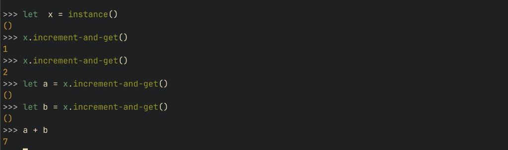

# rib-repl

A read-eval-print loop for **WebAssembly components**: call into your component, reuse the same running instance, and give names to values as you go. A small language, **Rib**, evaluates what you type—kept minimal so the focus stays on your component.

- **Syntax highlighting** in the prompt  
- **Tab completion** for exported function names  
- **Statically typed**: Rib checks types against your component before running calls  
- **Stateful** sessions: the same component instance and variables carry on as you enter more lines  
- **Embeddable** in runtimes like Wasmtime without much extra wiring  

## Example

